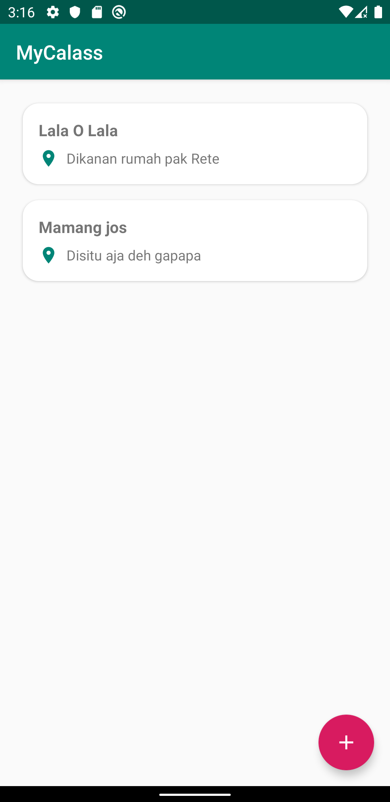
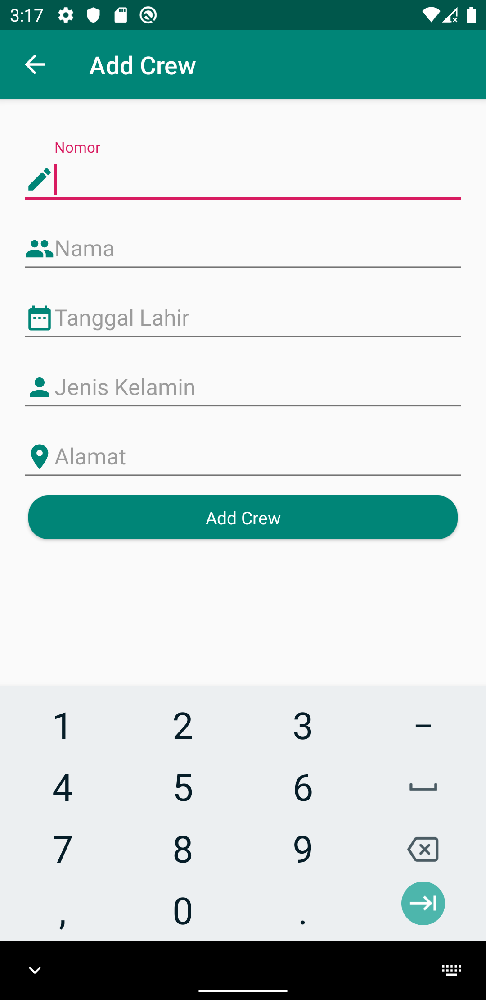
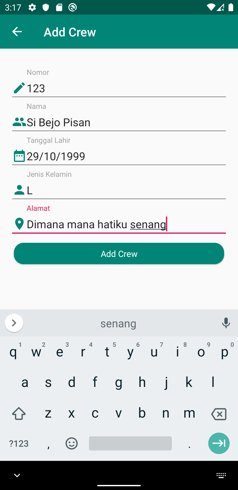
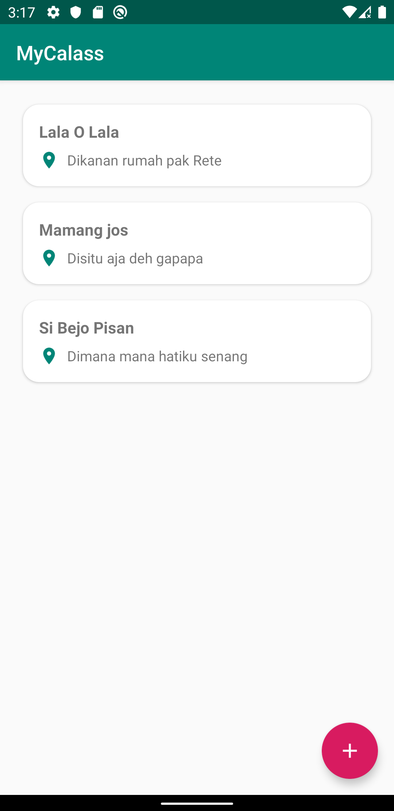
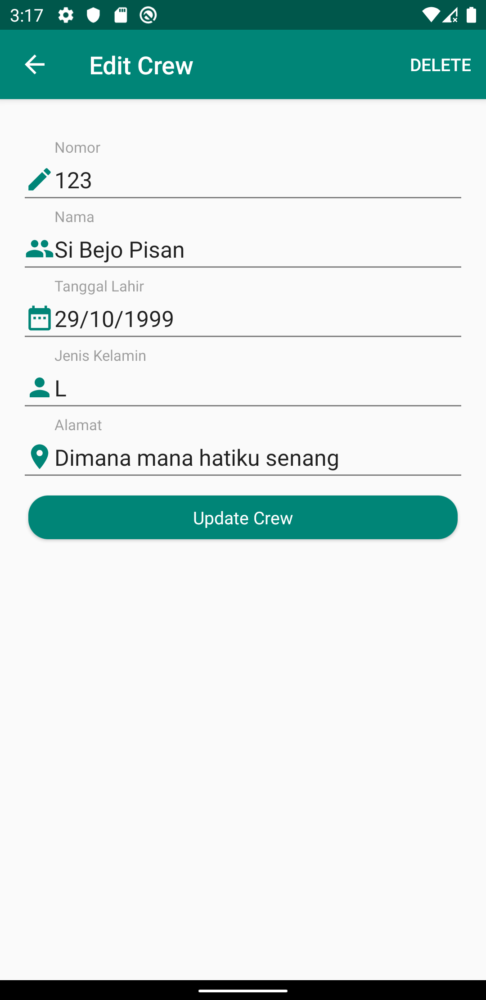
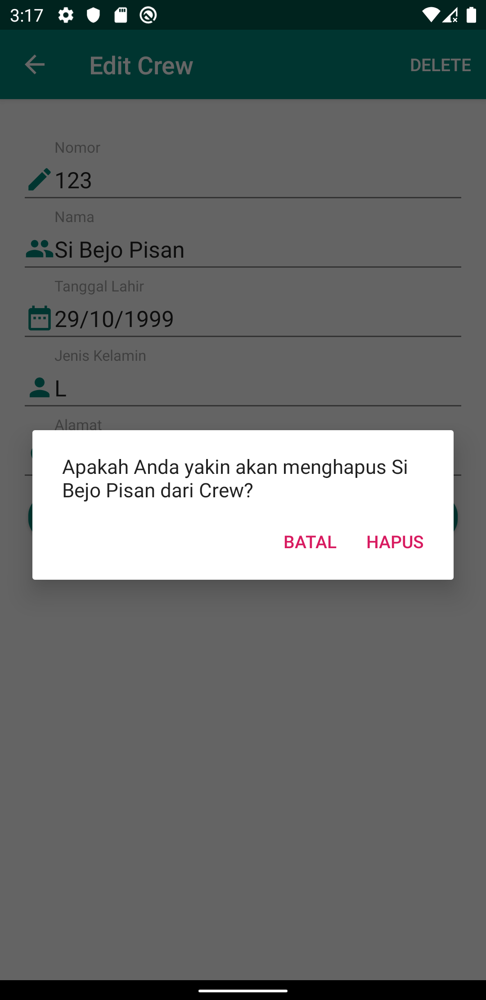
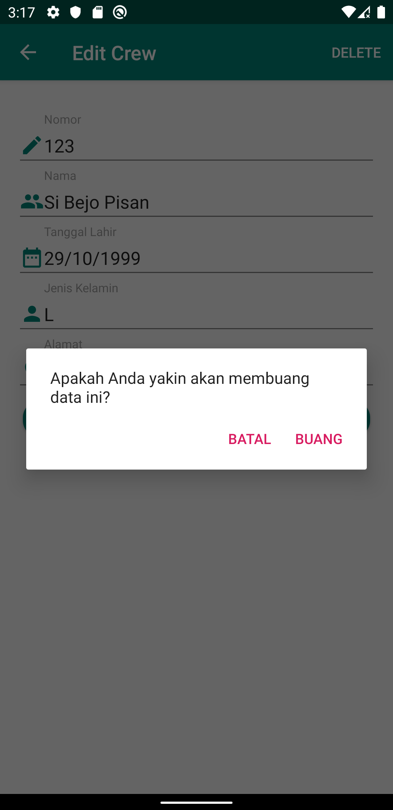

# MyClass

This project is chapter 9 of Mobile Programming lab practice exercises.

## Screenshot

### MainActivity

 

### Detail Acitivty ( Add Crew )

 

### Detail Activity ( Update Data )

 

### Detail Acitivity ( Alert Dialog )

 
