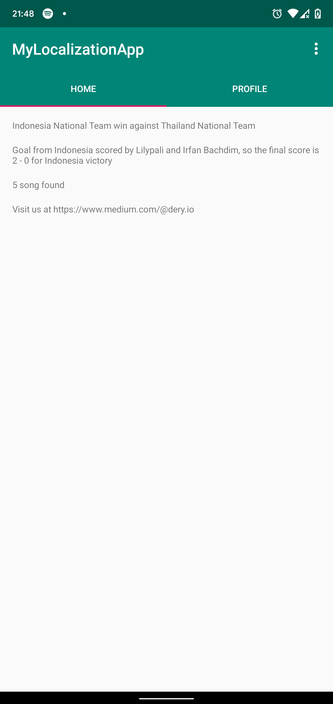
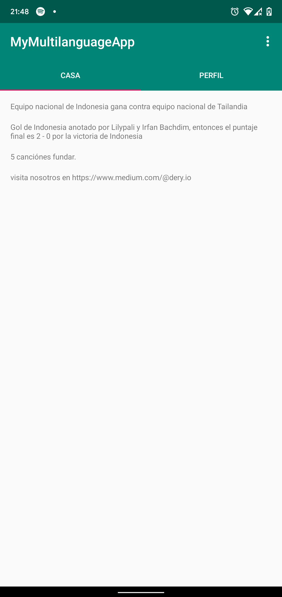
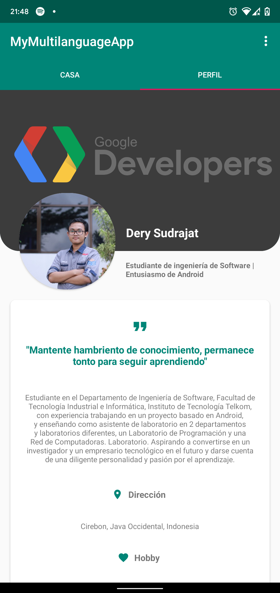

# MyLocalization

Project Lesson 7 - Understanding about how to create an app with multi language

## Screenshot

### MainActivity
### Home Fragment & Profile Fragment (EN)

 

### Home Fragment & Profile Fragment (SP)

 

