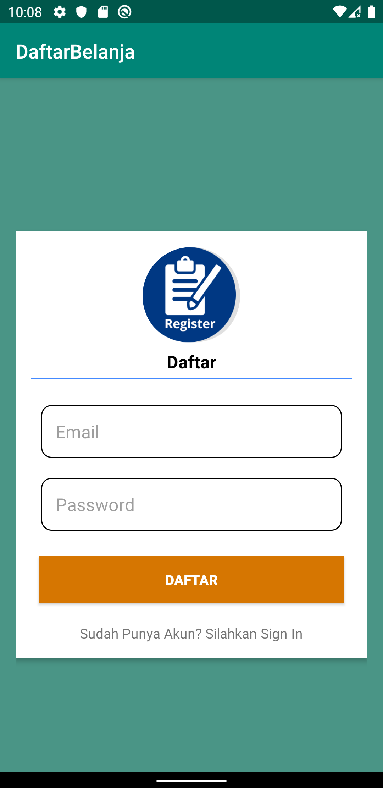
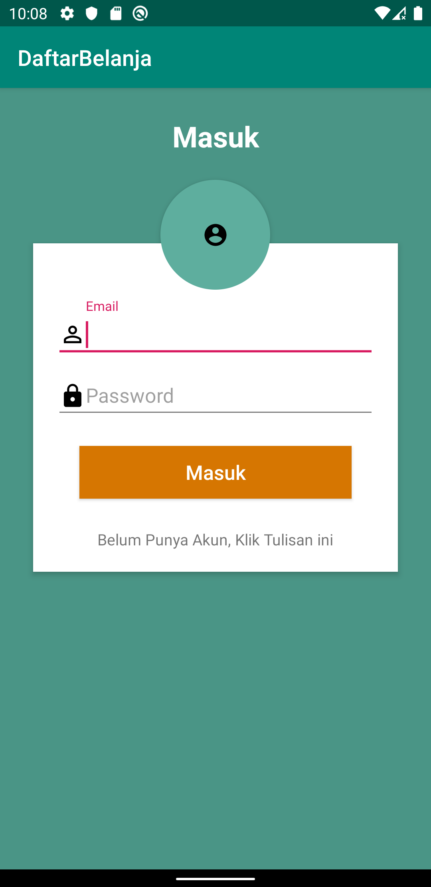
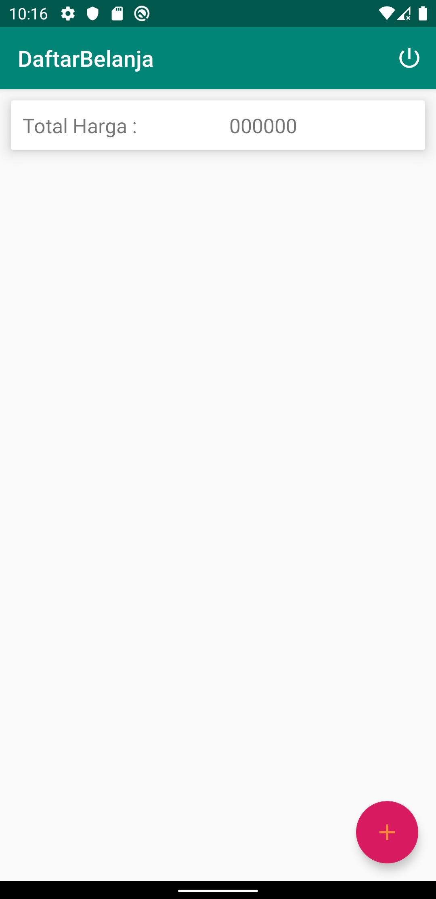
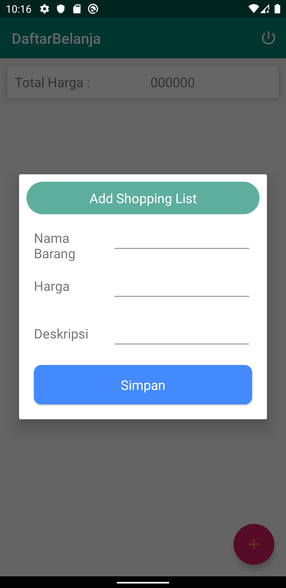
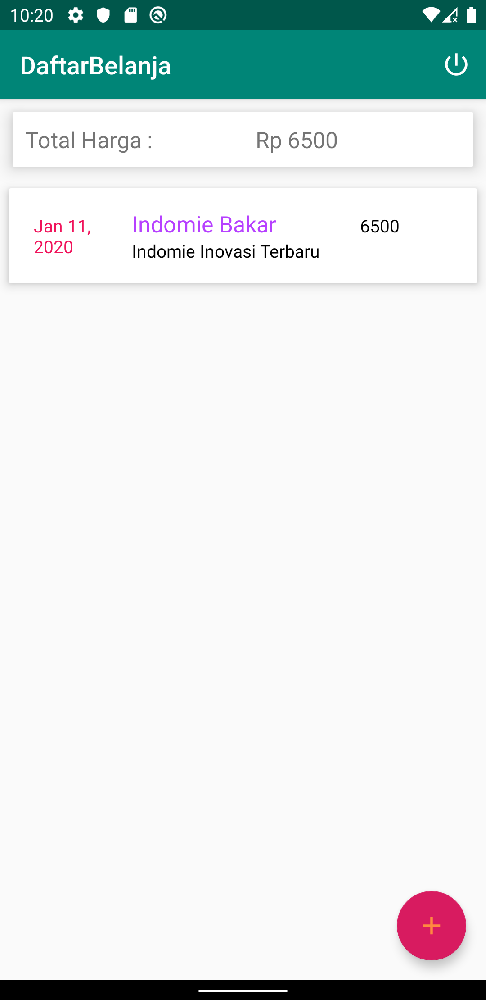
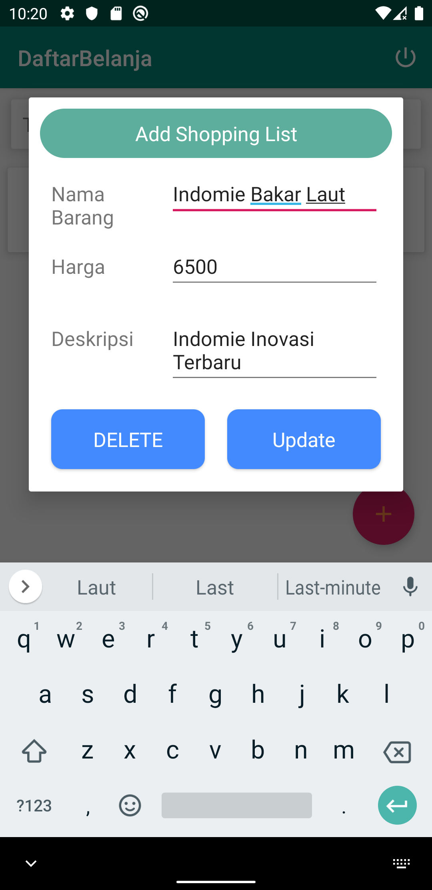
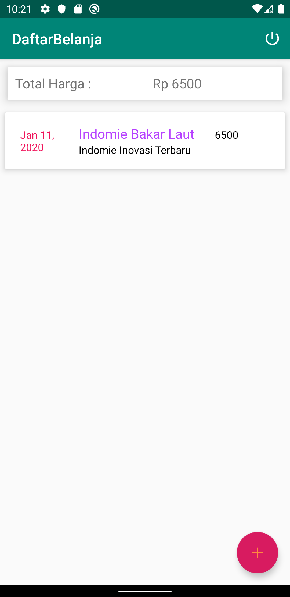

# MyClass

This project is chapter 9 of Mobile Programming lab practice exercises.

## Screenshot

### Register Activity

 

### MainActivity (Login)

 

### Home Activity

### Home Activity (Add Data)
 

### Home Activity (Update Data)

 
